# Charitable

###### This is an helping application. Where there are three types (user, organization, admin) of user can login. User / Organization can ask for help. 
User can send money or accessories. Finantial post will be automatically moved to the archive section when all the money has beed raised. User can see there own posts or transection histroy.
Admin can check all posts. Admin has the ablity to remove a user / organization if needed. 

## Technologies / Libraries : 
* Firebase Auth,Realtime Database, Storage
* Picasso
* Lottie
* etc... 

## Screenshots
**Authentication**
 
 

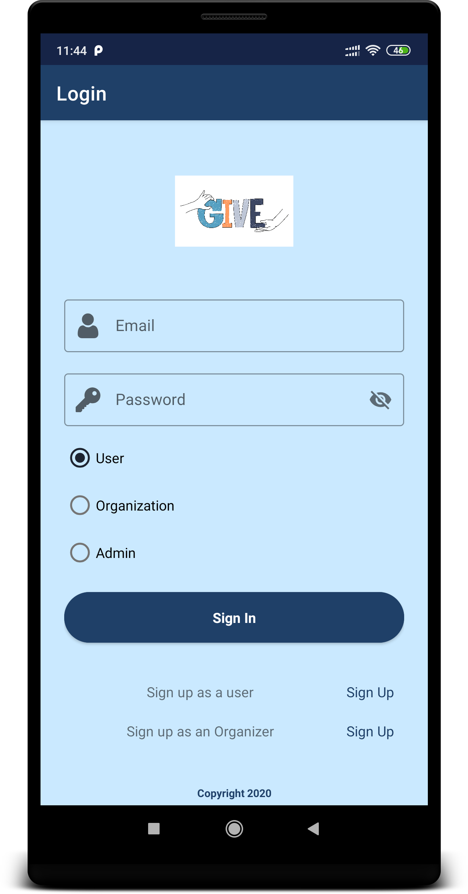 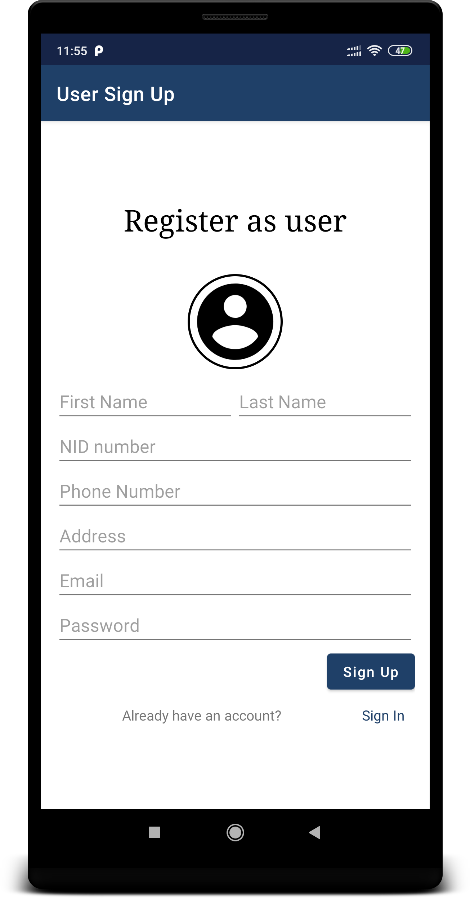    
**User Panel**
 
 
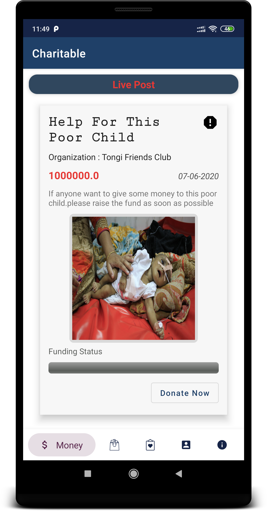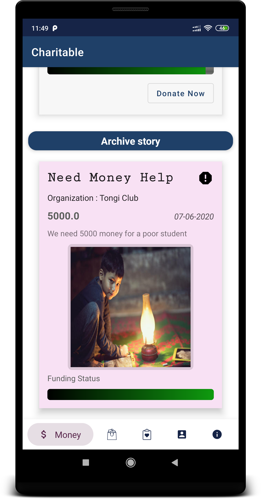 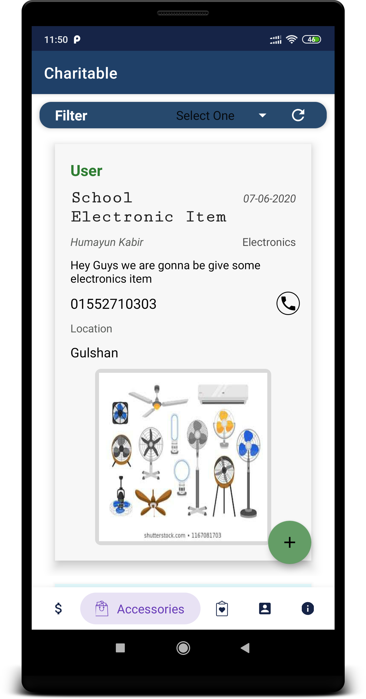 
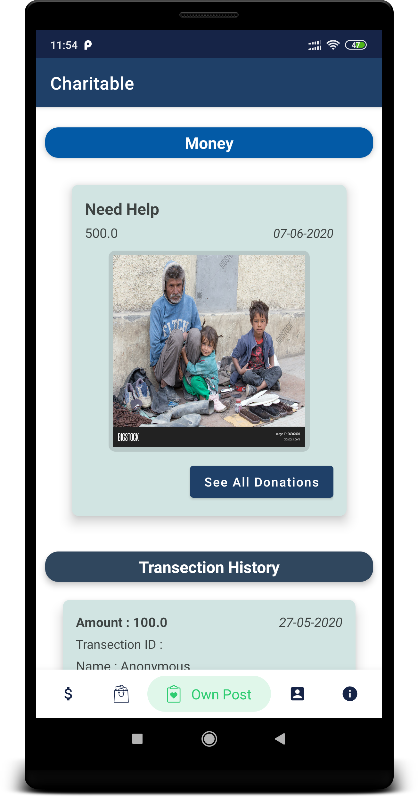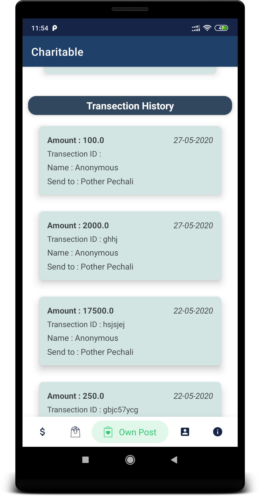 

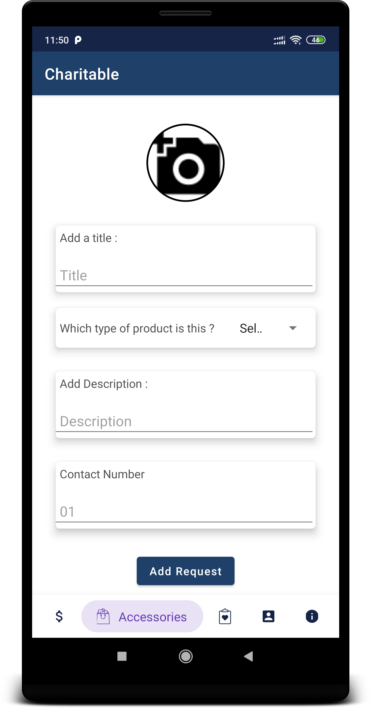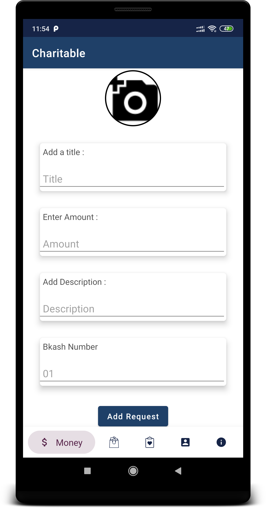 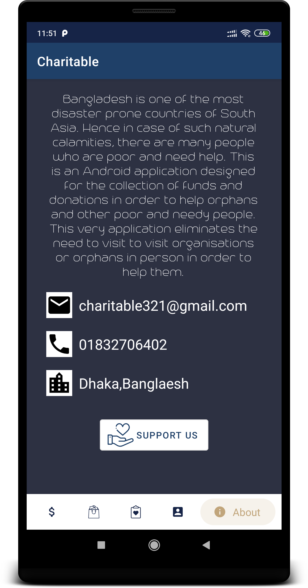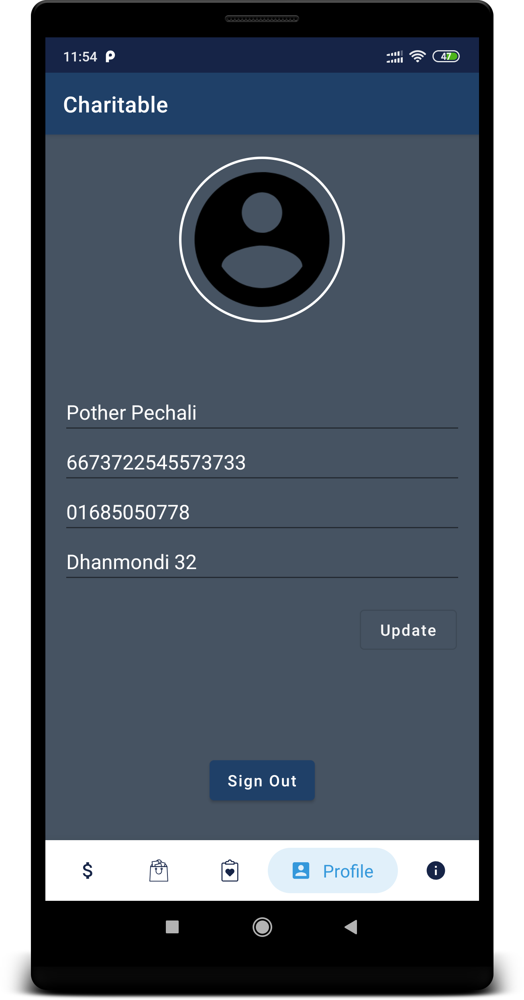 
**Admin Panel**
 
 
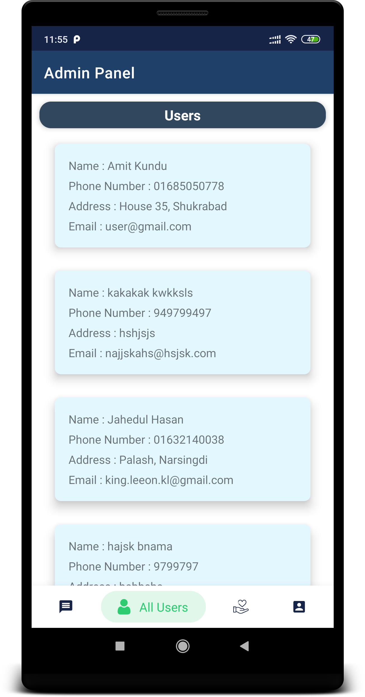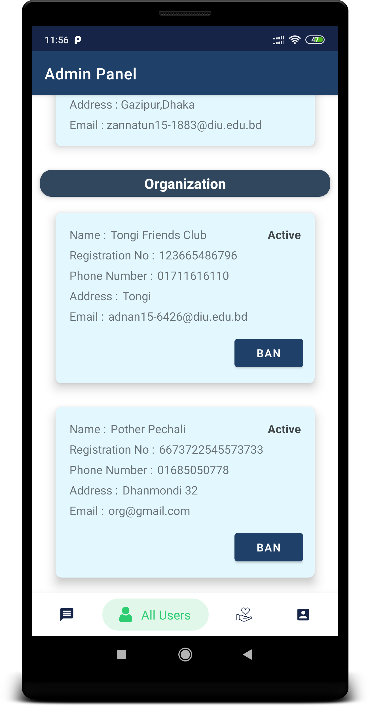 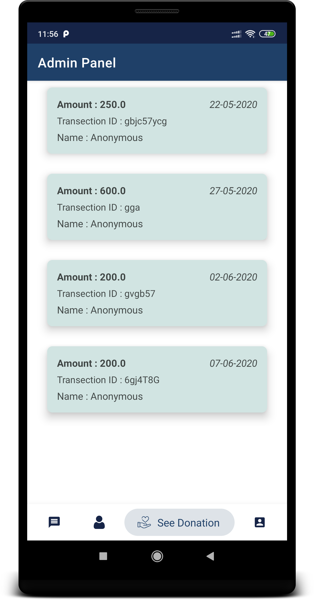 
